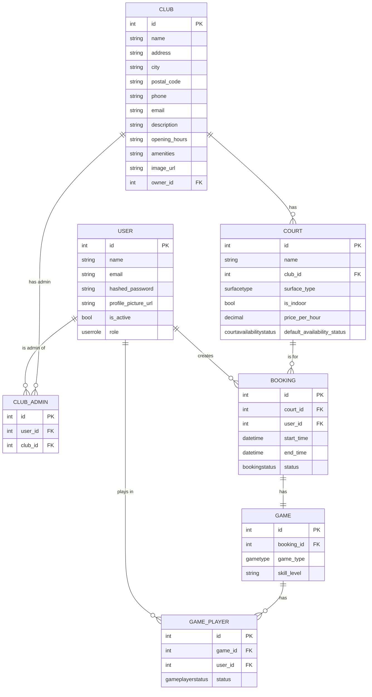

# PadelGo Database Schema

This document contains a visual representation of the database schema for the PadelGo application.

```mermaid
erDiagram
    USER {
        int id PK
        string name
        string email
        string hashed_password
        string profile_picture_url
        bool is_active
        userrole role
    }

    CLUB {
        int id PK
        string name
        string address
        string city
        string postal_code
        string phone
        string email
        string description
        string opening_hours
        string amenities
        string image_url
        int owner_id FK
    }

    CLUB_ADMIN {
        int id PK
        int user_id FK
        int club_id FK
    }

    COURT {
        int id PK
        string name
        int club_id FK
        surfacetype surface_type
        bool is_indoor
        decimal price_per_hour
        courtavailabilitystatus default_availability_status
    }

    BOOKING {
        int id PK
        int court_id FK
        int user_id FK
        datetime start_time
        datetime end_time
        bookingstatus status
    }

    GAME {
        int id PK
        int booking_id FK
        gametype game_type
        string skill_level
    }

    GAME_PLAYER {
        int id PK
        int game_id FK
        int user_id FK
        gameplayerstatus status
    }

    USER ||--o{ BOOKING : "creates"
    USER ||--o{ GAME_PLAYER : "plays in"
    USER ||--o{ CLUB_ADMIN : "is admin of"
    CLUB ||--o{ COURT : "has"
    CLUB ||--o{ CLUB_ADMIN : "has admin"
    COURT ||--o{ BOOKING : "is for"
    BOOKING ||--|| GAME : "has"
    GAME ||--o{ GAME_PLAYER : "has"
``` 